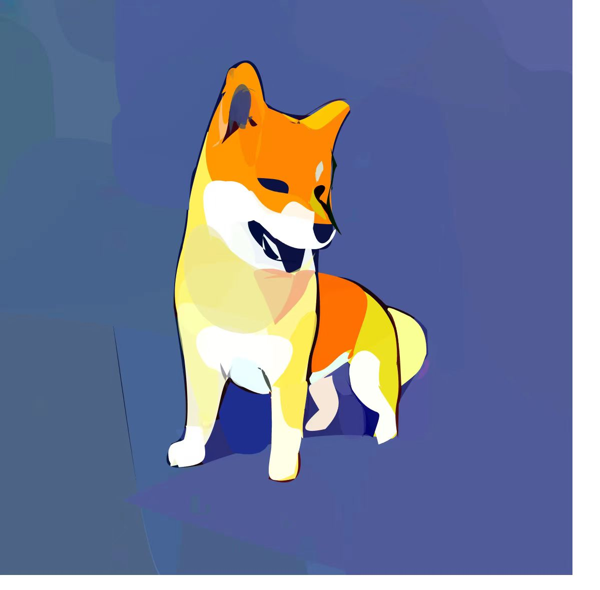

vector_fusion 论文复现


[](https://arxiv.org/abs/2211.11319)

<br>
<div align="center">
    
    
</div>
<br><br>

这是一篇小众的自动化矢量图生成,但是很有意思!


<br>

## Setup

1. Clone the repo:
```bash
git clone https://github.com/ydove0324/vector_fusion.git
cd vector_fusion
```
2. Create a new conda environment and install the libraries:
```bash
conda create --name vector_fusion python=3.8.15
conda activate vector_fusion
pip install torch==1.12.1+cu113 torchvision==0.13.1+cu113 --extra-index-url https://download.pytorch.org/whl/cu113
conda install -y numpy scikit-image
conda install -y -c anaconda cmake
conda install -y -c conda-forge ffmpeg
pip install svgwrite svgpathtools cssutils numba torch-tools scikit-fmm easydict visdom freetype-py shapely
pip install opencv-python==4.5.4.60  
pip install kornia==0.6.8
pip install wandb
pip install shapely
pip install open_clip_torch
```

3. Install diffusers:
```bash
pip install diffusers==0.8
pip install transformers scipy ftfy accelerate
```
4. Install diffvg:
```bash
git clone https://github.com/BachiLi/diffvg.git
cd diffvg
git submodule update --init --recursive
python setup.py install
```

5. Paste your HuggingFace [access token](https://huggingface.co/settings/tokens) for StableDiffusion in the TOKEN file.
## Run Experiments 
```bash
conda activate vector_fusion
cd vector_fusion

# Please modify the parameters accordingly in the file and run:
bash run_vector_fusion.sh

# Or run :
python code/main.py --experiment <experiment> --semantic_concept <concept> --seed <seed> 
如:
python code/main.py --experiment reinit --seed 147 --semantic_concept "bicycle" --optim_path 128 
```
* ```--semantic_concept``` : 你希望根据该语义信息生成图片,如"bicycle"
* ```--optim_path``` :  多少个矢量图贝塞尔曲线, 越多矢量图越精细, 但速度也越慢, 默认128, 若配置不行, 可以64或32

Optional arguments:
* ```--prompt_suffix``` : Default: "minimal flat 2d vector. lineal color. trending on artstation"


## Acknowledgement
这些代码基于以下工作
1. [Diffusers](https://github.com/huggingface/diffusers) 
2. [Diffvg](https://github.com/BachiLi/diffvg). 
3. [Live](https://github.com/Picsart-AI-Research/LIVE-Layerwise-Image-Vectorization).
4. [Word_As_Image](https://github.com/Shiriluz/Word-As-Image)
5. [open-clip](https://github.com/mlfoundations/open_clip)
    
    
## Licence
This work is licensed under a [Creative Commons Attribution-ShareAlike 4.0 International License](http://creativecommons.org/licenses/by-sa/4.0/).
